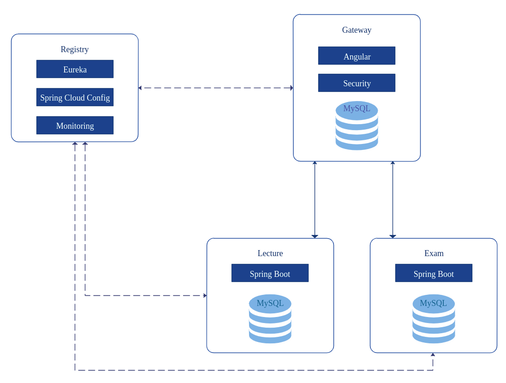

# Microservices Application using JHipster

## Setup
### Run with docker-compose
1. Install docker and docker-compose
2. Navigate to ./exam
3. Run ``gradlew bootJar jibDockerBuild``
4. Navigate to ./lecture
3. Run ``gradlew bootJar jibDockerBuild``
4. 2. Navigate to ./gateway
3. Run ``gradlew bootJar jibDockerBuild``
5. Navigate to ./docker
6. Run ``docker-compose up``
7. Go to http://localhost:8080

## Architecture
The following diagram shows details about the architecture of the project. 

It consists of 2 microservice application - Exam and Lecture, a Gateway and a Registry.

### Registry
The Registry is an application that serves 3 main purposes:
1. Service discovery - it is a Eureka server which maintains a list of the application instances.
   When the gateway and microservices are launched they register themselves in the registry.
   It is used by the gateway to know which microservices are up and running.
   It is also used by Hazelcast distributed cache to automatically scale.

2. Application configuration - it is a Spring Cloud Config server and holds the configuration for the applications.
   When application (gateway or microservice) is launched, it connects to the registry to get the configuration data.

3. Monitoring - provides administration possibilities with dashboards to monitor and manage applications.

### Gateway
The Gateway is a JHipster application of type application gateway. It serves the frontend which is 
an Angular application and handles the Web traffic. 
It will automatically proxy all requests sent to the microservices. For example the microservice exam will be available on the gateway on URL **/services/exam**. 
The gateway also takes care for authentication and authorization. The user tokens which are self-sufficient and include both authentication and authorization data are generated by the gateway and sent to the microservices. 
The registry has provided them the same secret key, so the microservices can validate the token and authenticate the users.

### Exam
Exam is a microservice JHipster application. It is a Spring Boot application and supports CRUD (Create, Read, Update and Delete) operations for the Exam entity.

### Lecture
Lecture is the second microservice application. It is a Spring Boot application and supports CRUD operations for the Lecture entity.

